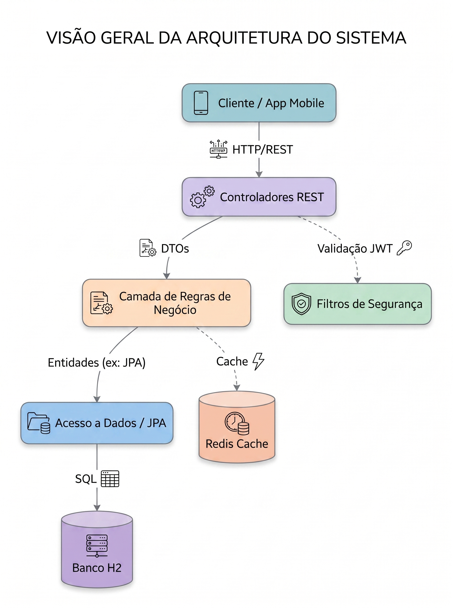
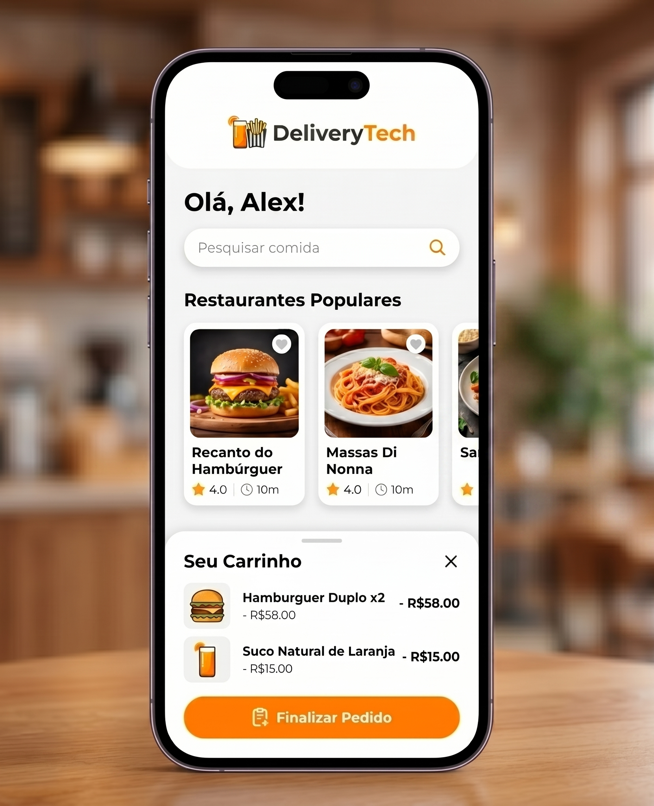

# Documentação da API DeliveryTech

    

## Índice
1. [Objetivo e Escopo do Projeto](#1-objetivo-e-escopo-do-projeto)
2. [Tecnologias e Dependências](#2-tecnologias-e-dependencias)
3. [Arquitetura e Fluxos do Sistema](#3-arquitetura-e-fluxos-do-sistema)
4. [Protótipo de Interface (UI)](#4-prototipo-de-interface-ui)
5. [Diagrama de Classes (UML)](#5-diagrama-de-classes-uml)
6. [Referência da API (Endpoints)](#6-referencia-da-api-endpoints)
7. [Possíveis Melhorias](#7-possiveis-melhorias)

## 1. Objetivo e Escopo do Projeto

O **DeliveryTech** é um sistema completo focado no ecossistema de delivery de comida. O principal objetivo é atuar como uma ponte digital eficiente entre três pilares fundamentais:
- **Clientes**: Usuários que navegam por restaurantes, visualizam produtos e fazem pedidos.
- **Restaurantes**: Estabelecimentos que gerenciam seus produtos e recebem os pedidos.
- **Administradores/Entregadores**: Responsáveis por gerenciar o status do sistema e o fluxo de entrega.

O escopo engloba desde o cadastro e autenticação segura de usuários até o ciclo completo de um pedido (criação, adição de itens, cálculo de taxas e acompanhamento de status).

## 2. Tecnologias e Dependências

Este projeto foi construído utilizando as ferramentas mais robustas e modernas do ecossistema Java:

- **Java 21**: Linguagem base do projeto, aproveitando os recursos mais recentes como Records e Virtual Threads (quando aplicável).
- **Spring Boot 3.2.x**: Framework central que gerencia injeção de dependências, configuração automática e criação da API REST.
- **Spring Security + JWT (JSON Web Tokens)**: Garante que os endpoints estejam protegidos e fornece um sistema de controle de acesso baseado em funções (RBAC).
- **Spring Data JPA & Hibernate**: Ferramentas de mapeamento objeto-relacional (ORM) para simplificar as interações com o banco de dados.
- **H2 Database**: Banco de dados relacional em memória utilizado para agilizar o desenvolvimento e facilitar testes automáticos sem a necessidade de infraestrutura externa.
- **Redis & Spring Cache**: Sistema de cache em memória para otimizar requisições repetitivas e aliviar a carga no banco de dados principal.
- **Springdoc OpenAPI (Swagger)**: Gera documentação interativa automaticamente baseada em anotações no código.
- **Micrometer + Zipkin Tracing**: Ferramentas focadas em observabilidade, permitindo o rastreamento distribuído de chamadas na API.
- **Lombok**: Biblioteca para reduzir a verbosidade do código Java (eliminando a necessidade de escrever Getters, Setters, Builders manualmente).

## 3. Arquitetura e Fluxos do Sistema

### 3.1. Visão Geral da Arquitetura
A aplicação adota a arquitetura em camadas (Layered Architecture), separando as responsabilidades e facilitando a manutenção.

### 3.2. Fluxo Principal: Realização de um Pedido
Este diagrama ilustra a interação entre o Cliente e o Sistema na hora de realizar um pedido.

## 4. Protótipo de Interface (UI)

Como a API foi projetada para ser o motor (Back-end) de uma solução multiplataforma, criamos protótipos conceituais de como a interface móvel (Front-end) consumiria estes dados para o usuário final.

**Descrição da Interface (Tela Principal & Carrinho)**
- **Tela Home (Lista de Restaurantes)**: Esta tela consumiria o endpoint `GET /api/restaurantes`, exibindo uma lista dinâmica com o nome, categoria e status dos restaurantes disponíveis. Categorias no topo permitiriam invocar o endpoint `GET /api/restaurantes/categoria/{categoria}`.
- **Tela de Carrinho (Resumo do Pedido)**: Esta seção consumiria os dados dos produtos via `GET /api/produtos/restaurante/{id}`. Ao confirmar, o carrinho envia um Payload (JSON) contendo a lista de itens, quantidades e IDs para o endpoint `POST /api/pedidos`, concretizando a venda.

## 5. Diagrama de Classes (UML)

O modelo de domínio do banco de dados reflete a modelagem lógica do sistema. Abaixo está o diagrama de classes detalhando as Entidades e suas relações (JPA):

## 6. Referência da API (Endpoints)

O controle de acesso varia por recurso. Usuários `ADMIN` têm poder total sobre o cadastro, enquanto `CLIENTES` podem interagir ativamente criando pedidos e gerindo seus perfis.

### 6.1. Autenticação e Usuários (`/api/auth`)
- **`POST /api/auth/register`**
  - **Resumo**: Cadastrar um novo usuário no sistema.
  - **Acesso**: Público.
  - **Retornos**: 200 (Sucesso, devolve o Token JWT), 400 (Email já cadastrado / Dados inválidos).

- **`POST /api/auth/login`**
  - **Resumo**: Autenticar um usuário existente.
  - **Acesso**: Público.
  - **Retornos**: 200 (Sucesso, devolve o Token JWT), 401 (Credenciais Inválidas).

### 6.2. Gerenciamento de Clientes (`/api/clientes`)
- **`POST /api/clientes`**
  - **Resumo**: Cadastrar um perfil de cliente. (Acesso: ADMIN, CLIENTE).
- **`GET /api/clientes`** e **`GET /api/clientes/all`**
  - **Resumo**: Listar clientes ativos, de forma paginada ou simplificada. (Acesso: ADMIN).
- **`GET /api/clientes/{id}`**
  - **Resumo**: Buscar detalhes de um cliente específico. (Acesso: ADMIN).
- **`PUT /api/clientes/{id}`**
  - **Resumo**: Atualizar as informações de contato do cliente. (Acesso: ADMIN, CLIENTE).
- **`PATCH /api/clientes/{id}/status`**
  - **Resumo**: Ativar ou inativar o cadastro de um cliente. (Acesso: ADMIN).
- **`DELETE /api/clientes/by-email/{email}`**
  - **Resumo**: Exclusão permanente de cliente por E-mail. (Acesso: ADMIN).

### 6.3. Operações com Pedidos (`/api/pedidos`)
- **`POST /api/pedidos`**
  - **Resumo**: Cria um novo pedido, associando itens, cliente e restaurante. Calcula o total baseado nos valores dos produtos. (Acesso: CLIENTE).

### 6.4. Catálogo de Produtos (`/api/produtos`)
- **`POST /api/produtos`**
  - **Resumo**: Adicionar um novo produto ao menu de um restaurante. (Acesso: ADMIN).
- **`GET /api/produtos/restaurante/{restauranteId}`**
  - **Resumo**: Listar todos os produtos associados a um restaurante específico.
- **`PUT /api/produtos/{id}`**
  - **Resumo**: Atualizar preço, descrição ou categoria. (Acesso: ADMIN).
- **`PATCH /api/produtos/{id}/disponibilidade`**
  - **Resumo**: Alterar o status (em estoque ou esgotado). (Acesso: ADMIN).

### 6.5. Catálogo de Restaurantes (`/api/restaurantes`)
- **`POST /api/restaurantes`**
  - **Resumo**: Cadastrar um novo restaurante. (Acesso: ADMIN).
- **`GET /api/restaurantes`**
  - **Resumo**: Listar todos os restaurantes disponíveis. (Acesso: ADMIN).
- **`GET /api/restaurantes/{id}`**
  - **Resumo**: Exibir informações específicas pelo ID. (Acesso: ADMIN).
- **`GET /api/restaurantes/categoria/{categoria}`**
  - **Resumo**: Filtro de pesquisa de restaurantes por segmento (ex: Pizza, Sushi). (Acesso: ADMIN).
- **`PUT /api/restaurantes/{id}`**
  - **Resumo**: Atualizar informações de cadastro e taxas de entrega. (Acesso: ADMIN).
- **`DELETE /api/restaurantes/by-nome/{nome}`**
  - **Resumo**: Remoção de restaurante pelo nome. (Acesso: ADMIN).

### 6.6. Saúde do Sistema (Health Check)
- **`GET /health`**
  - **Resumo**: Verificar o status UP da API (Endpoint vital para balanceadores de carga).
- **`GET /info`**
  - **Resumo**: Obter detalhes técnicos sobre as versões em execução do Java e Framework.

## 7. Possíveis Melhorias

Apesar de ser um sistema coeso, para uma implantação a nível de produção massiva (Escalabilidade), sugerimos as seguintes melhorias técnicas na arquitetura:

1. **Migração do Banco de Dados**: Substituir o banco H2 (voltado para testes e homologação) por um Banco de Dados Relacional em Produção, como o **PostgreSQL** ou **MySQL**.
2. **Arquitetura Orientada a Eventos (Mensageria)**: Para lidar com picos de pedidos (como horários de almoço/jantar), é recomendável implementar uma fila (ex: **RabbitMQ** ou **Apache Kafka**) para processar os pedidos (`PedidoService`) assincronamente.
3. **Gateway de Pagamento**: Integração direta com APIs de pagamento (ex: Stripe, Mercado Pago) para processar o `total` cobrado no pedido antes de confirmá-lo.
4. **Armazenamento de Imagens**: Implementação de upload de imagens (para produtos e perfis de clientes) conectados a um serviço cloud como **Amazon S3** e entrega via CDN.
5. **Microsserviços**: Em caso de hipercrescimento, o Monólito atual pode ser dividido em Microsserviços independentes (ex: `auth-service`, `catalog-service`, `order-service`), orquestrados por um API Gateway (ex: Spring Cloud Gateway).
